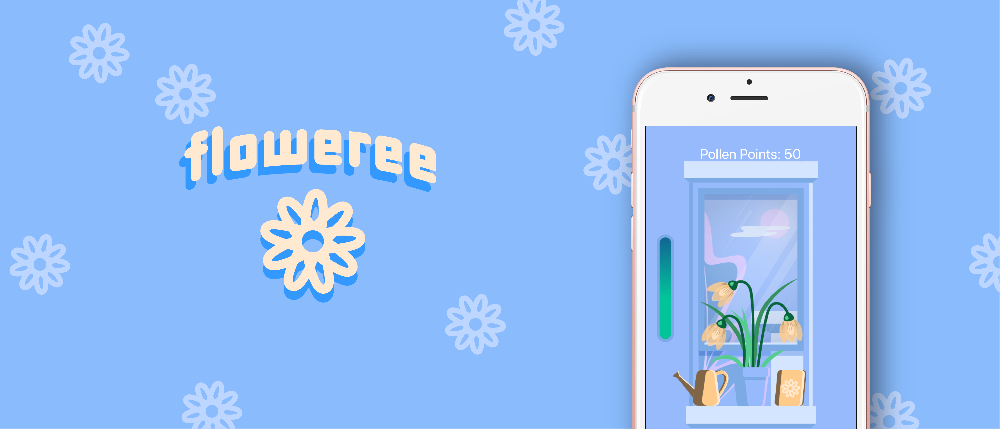
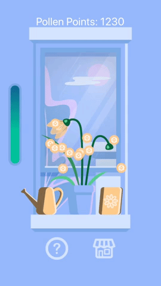
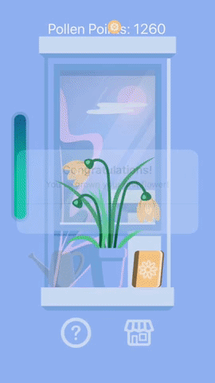
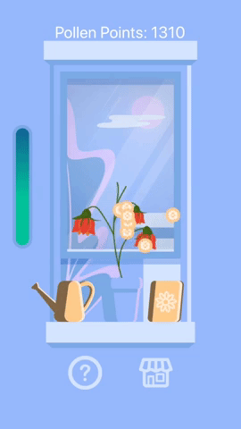
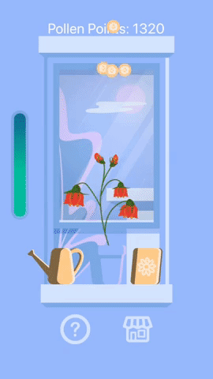

<p align="center">
	
</p>

# floweree

**floweree** is a cross platform mobile application which allows a user to **grow virtual flowers** over a seven-day period. The app opens to a home screen where the user can learn more about the game and begin playing by planting a flower. The game requires the user to come back every day to make sure their plant is receiving proper amounts of water. A meter tells the user the current status of the plant and indicates how much it should be watered. The meter goes down 1 level each day; after four days without water the flower dies and is then reset to the first flower with the user thus losing the game. If the user successfully grows the plant, a congratulatory message is displayed. An image of the flower is also then placed in the app's album. There are 5 different flowers that the user can grow before beating the game. Pollen points are collected every other time the plant is watered. In the future, these points will allow the user to purchase in-app upgrades such as fertilizer, a variety of planter pots, and different seeds to grow.

## Screenshots

<p align="center">
	
</p>

<p align="center">
	
	
	
	
	
</p>

## New Developer Steps

In order for a new developer to take over this project they will have to install [Node.js](https://nodejs.org/en/) on their computer and the [Expo Client app](https://itunes.apple.com/app/apple-store/id982107779) on their smartphone.

Once Node.js has been installed, open your CLI and run the following commands:

```
git clone https://github.com/johngarner/floweree.git
cd floweree
npm install
// at this point install the following modules:

   // react navigation: https://reactnavigation.org/docs/en/getting-started.html
   // react moment: https://www.npmjs.com/package/react-moment
   // react native particles: https://www.npmjs.com/package/react-native-particles

npm start
```

A page for the development server will open in your browser. On the left bar, click "Run on iOS simulator" if you have Xcode or use your phone to scan the QR code to use the Expo Client app.

## In the Future

Beyond the MVP, the inclusion of a greater variety of plants, allowing for more factors to affect the plants (e.g. fertilizer, animals, weather, etc.) would be desirable. Additional features could include the addition of music, location-based in-app weather, and tips teaching the user applicable gardening techniques. 
