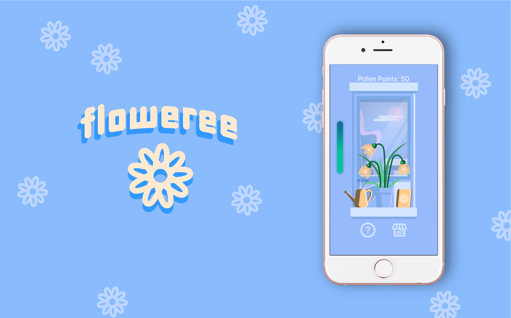

<p align="center">
	
</p>

# floweree

Floweree is a cross platform game app which allows users to grow virtual plants over a 7 day period. The app opens to a homescreen where users can either press a button to learn more about the game or press another button to begin playing. The game requires the user to come back everyday to make sure their plant is receiving proper amounts of water. A meter tells the user the current status of the plant and indicates how much it should be watered. The meter goes down 1 level every day and after 4 days without water the flower dies and game resets for the player to regrow the first flower. If the player successfully grows the plant a congratulatory message is displayed. An image of the flower is also then placed in the flower album. There are 5 different flowers that users can grow after which the game is over. Pollen points are collected every other time the plant is watered. In the future, users will be able to use these points to purchase game upgrades like fertilizers, pots, and different flower seeds.

## Screenshots

<p align="center">
	
</p>

<p align="center">
	
	
	
</p>

## New Developer Steps

In order for a new developer to take over this project they will have to install  on their computer and the  on their smartphone. If they want to build it on their machine they can used Xcode to simulate a device. 

Once Node.js has been installed, open the Terminal and run the following commands

```
cd your/code/directory
git clone https://github.com/johngarner/floweree.git
cd floweree
npm install
// at this point install the following modules:

   // react navigation: https://reactnavigation.org/docs/en/getting-started.html
   // react moment: https://www.npmjs.com/package/react-moment
   // react native particles: https://www.npmjs.com/package/react-native-particles

npm start
```

A website for the development server will pop up in your browser. On the left bar, click "Run on iOS simulator" if you have Xcode, or use your phone to scan the QR code to run the code in the Expo app.

## Minimum Viable Product Goals 

Our goal is to create a cross platform app were users will be able to successfully water and grow a flower. We want our artwork to be all original and the game to be a visually appealing and fun experience. 

## In the Future

Beyond our MVP we would like to include a greater variety of plants, allow for more factors to affect the plant (ex. fertilizer boosters, worms, natural disaster warnings, ect). We also want to add music within the app and have thought about potentially having the actual weather of the users location be reflected in the app. For example, today it was raining in Saint Paul so ideally it would rain in the app so the flower would be automatically watered. Additionally, we would be interesting in adding an educational aspect to this game in which fun facts appear on the screen and teach the user gardening techniques. 


